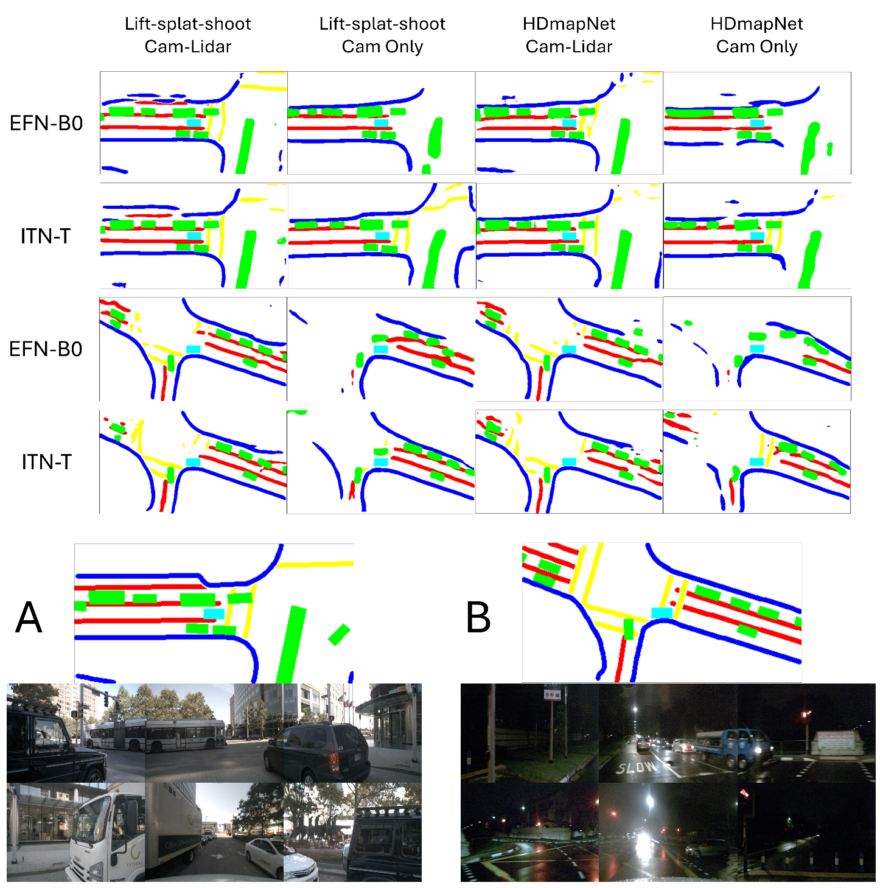

# Autonomous Driving and Robotics Portfolio

[한국어](README_ko.md)

Woo min Jun's project archive covering real-vehicle integration, perception, CARLA driving research, robotics, and drone simulation.

## Projects and demonstrations

| Project | Work and contribution | Demonstration |
| --- | --- | --- |
| ERP42 lane keeping | Integrated vehicle hardware and software, RS232 communication, ROS control, and camera-based lane detection. Tested lane keeping on a real vehicle. | [Driving video](https://youtu.be/_pjnSMG2kxE) |
| Multi-task perception and 3D SLAM | Developed and deployed a multi-task perception model on a vehicle and calibrated it with a 3D SLAM pipeline. | [Vehicle demo](https://youtu.be/ng5Ybwfu_Hg) |
| BEV local path planning | Visualized a local path available to the ego vehicle in BEV. | [Planning demo](https://youtu.be/XU9eV1rfoUM) |
| ST-P3 in CARLA | Ran an end-to-end driving model in simulation and visualized BEV observations and controls. | [Examples](docs/projects.md#st-p3-in-carla) |
| Earlier CARLA reinforcement-learning research | Worked on model direction and reward design for driving with vehicles and traffic signals. | [Driving demo](https://youtu.be/x9dXy39g8uU) |
| Multimodal LLM and driving RL | Explored multimodal LLM use in end-to-end reinforcement-learning research. | [Research demo](https://youtu.be/raNKD-_KNF0) |
| Isaac Sim and glove integration | Connected a glove interface with simulation and explored reinforcement learning in Isaac Sim. | [Demo](https://youtu.be/wOnYERak4DE) |
| QT128 LiDAR and tracked robot | Used a QT128 LiDAR for point-cloud visualization and worked with a tracked vehicle. | [Photos](docs/projects.md#lidar-and-tracked-robot) |
| Depth to 3D point cloud | Converted depth-map data to a 3D point-cloud representation. | [Examples](docs/projects.md#depth-to-point-cloud) |
| GPS and 3D SLAM calibration | Compared real campus GPS positions with a map built using a Velodyne 32-channel LiDAR. | [Examples](docs/projects.md#gps-and-slam-calibration) |
| AirSim multi-drone control | Controlled multiple drones using Python in AirSim. | [Demo](https://youtu.be/yvPjAFwAV1I) |
| AirSim, PX4, and QGroundControl | Planned drone routes and executed route-following experiments. | [Demo](https://youtu.be/-G0ETnGmNgc) |
| MORAI competition simulation | Used the MORAI simulator for a Baemin competition project. | |

## Research writing

- **Research Trends Focused on End-to-End Learning Technologies for Autonomous Vehicles**: coauthored journal article, November 2024, Vol. 49, No. 11. [DOI](https://doi.org/10.7840/kics.2024.49.11.1614)
- **Performance Comparison of Deep Reinforcement Learning Algorithms for Autonomous Driving in CARLA Simulators**: research manuscript comparing DDPG, SAC, TD3, PPO, and TQC.

See [project details and images](docs/projects.md) for the visual archive.

## Dedicated repositories

| Project | Repository |
| --- | --- |
| BEV label consistency | [HBLR](https://github.com/junwoomin/HBLR) |
| Cooperative BEV feature fusion | [FusionFormer](https://github.com/junwoomin/fusionformer) |
| Low Resource Simulation | [LRS](https://github.com/junwoomin/LRS) |
| Fleet occupancy mapping and multi-agent mapping demo | [CoReM](https://github.com/junwoomin/CoReM) |
| BEV parking | [BEV-Parking](https://github.com/junwoomin/BEV-Parking) |
| SDV UI and FMTC four-LiDAR demo | [SDV](https://github.com/junwoomin/SDV) |
| BEVFormer, traffic-light perception, and current driving-policy training | [AGILEQ-Training](https://github.com/SungjinDavidLee/AGILEQ-Training) |
| Driving-policy evaluation | [AGILEQ-Evaluation](https://github.com/SungjinDavidLee/AGILEQ-Evaluation) |
| Tenstorrent accelerator work | [P100a project](https://github.com/junwoomin/tenstorrent_p100a_project) |
