# Project Details and Images

## BEV perception and local planning

Compared BEV representations while developing perception around the ego vehicle. The local-planning demonstration visualizes a path in BEV.

[Local path planning video](https://youtu.be/XU9eV1rfoUM)

## ST-P3 in CARLA

Ran ST-P3 for end-to-end autonomous driving in CARLA. These examples show BEV observations alongside traffic, stop, junction, and control values.

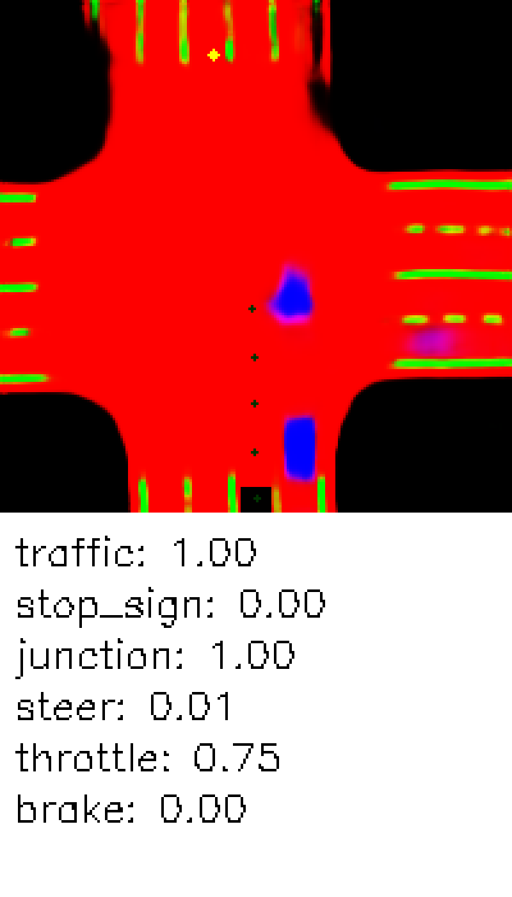

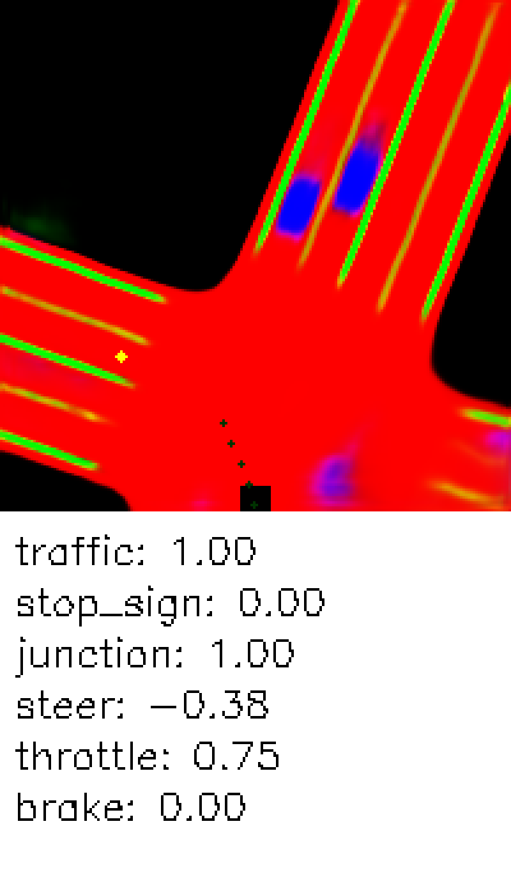

## Earlier reinforcement-learning experiments

Worked on driving-model direction and reward-function design, considering vehicles and traffic signals. The visual example records driving during training.

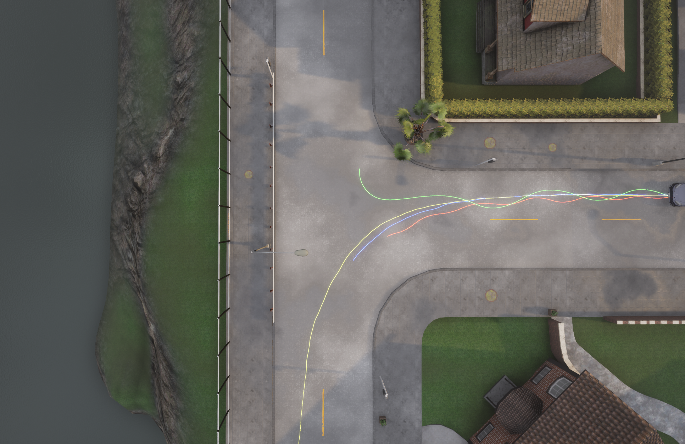

[Driving demonstration](https://youtu.be/x9dXy39g8uU)

The historical manuscript compares DDPG, SAC, TD3, PPO, and TQC. The current CrossQ/CrossQ++ training implementation is maintained in [AGILEQ-Training](https://github.com/SungjinDavidLee/AGILEQ-Training).

## Isaac Sim and glove integration

Worked with Isaac Sim, a glove interface, and reinforcement learning in simulation.

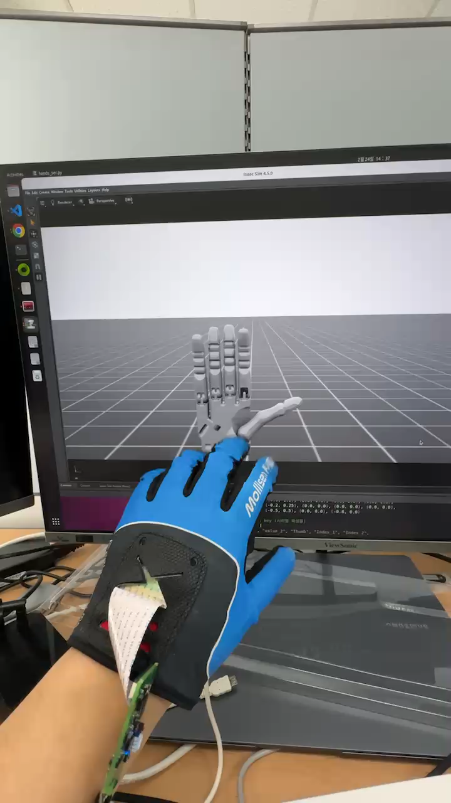

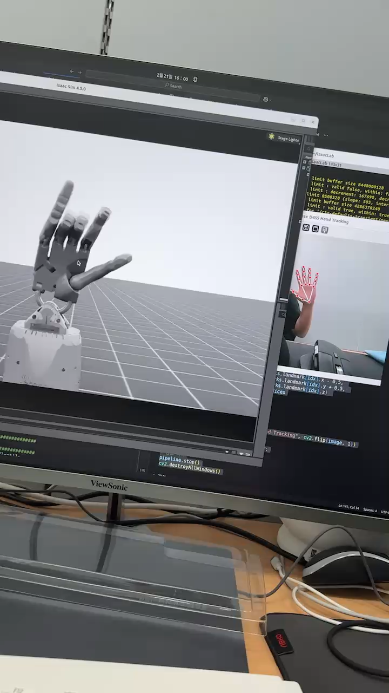

[Demonstration video](https://youtu.be/wOnYERak4DE)

## LiDAR and tracked robot

Used a QT128 LiDAR and visualized point clouds. Also worked with a tracked vehicle.

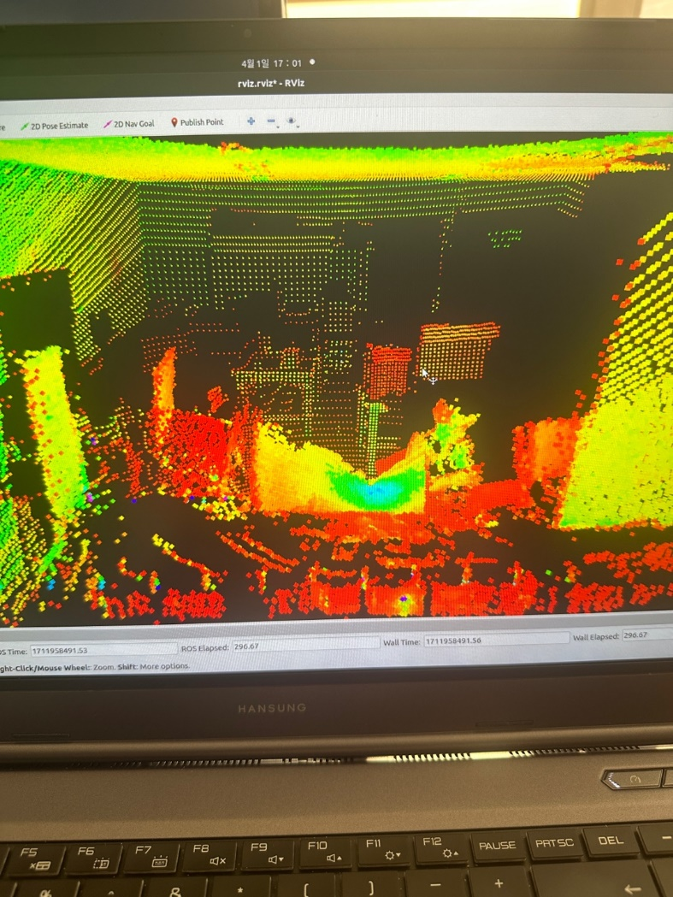

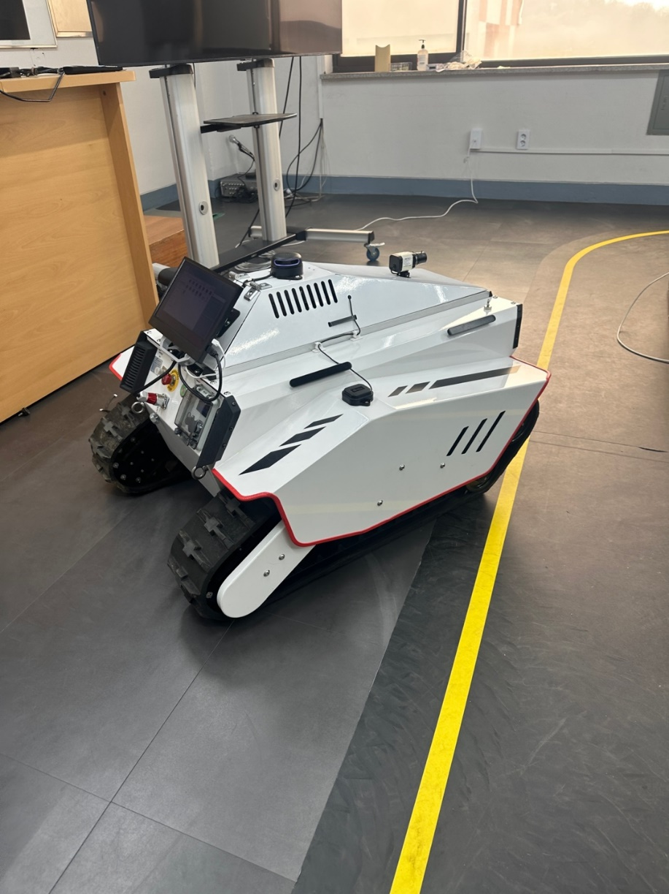

## Depth to point cloud

Converted depth maps into 3D point clouds and visualized the resulting geometry.

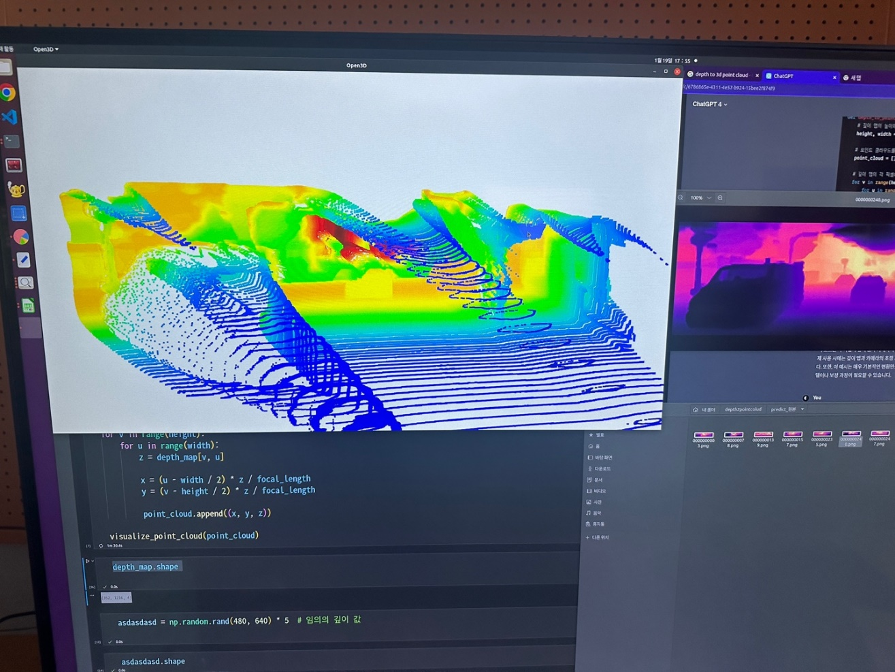

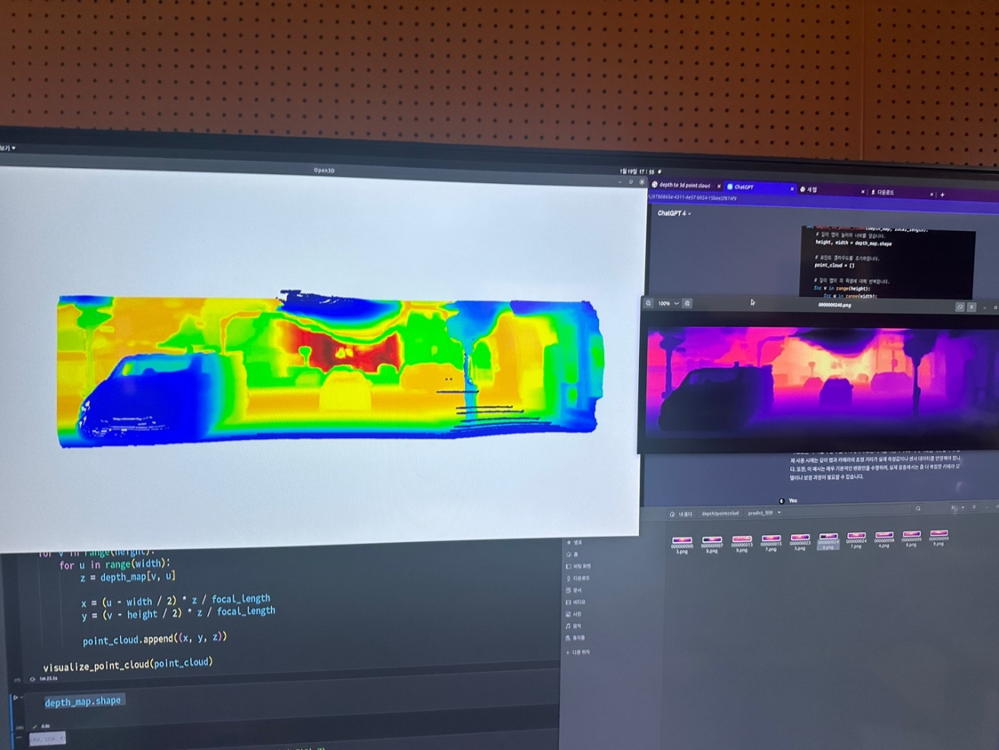

## GPS and SLAM calibration

Compared campus GPS positions with a 3D SLAM map produced using a Velodyne 32-channel LiDAR.

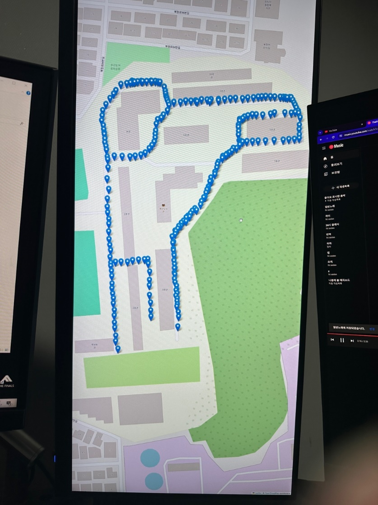

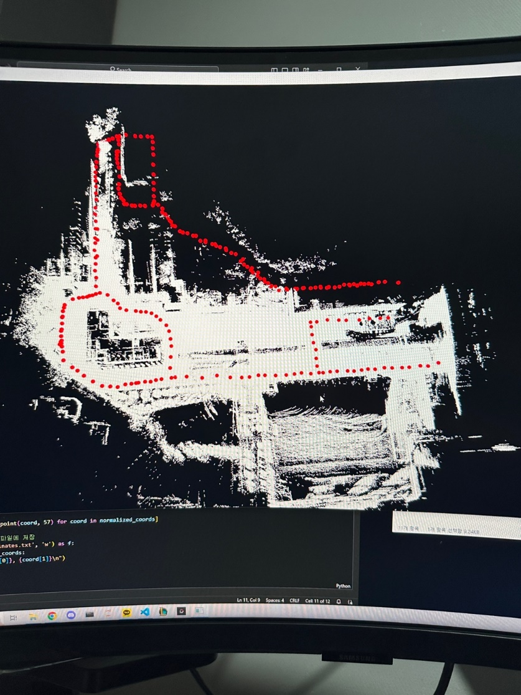

## Research writing

### End-to-end learning survey

Coauthored **Research Trends Focused on End-to-End Learning Technologies for Autonomous Vehicles**, published in November 2024, Vol. 49, No. 11.

[DOI](https://doi.org/10.7840/kics.2024.49.11.1614)

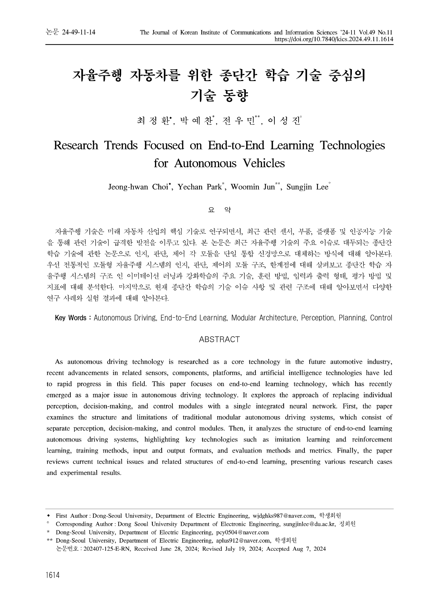

### CARLA reinforcement-learning comparison

Research manuscript: **Performance Comparison of Deep Reinforcement Learning Algorithms for Autonomous Driving in CARLA Simulators**.

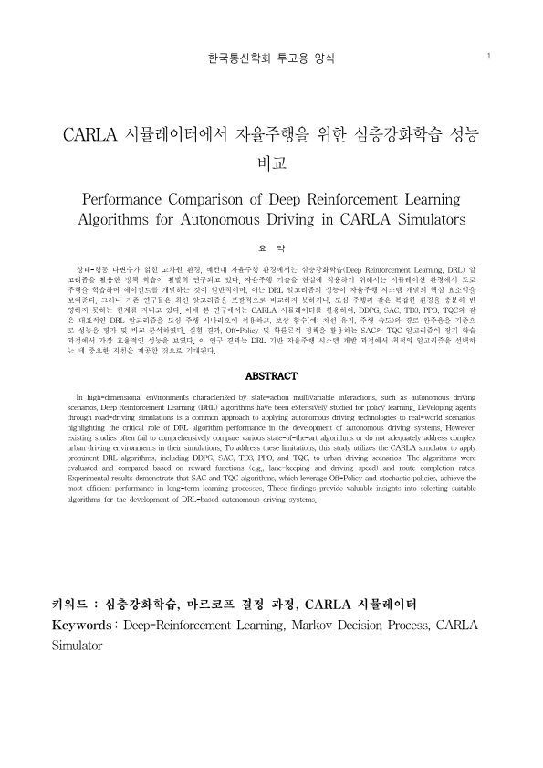

## Additional demonstrations

| Work | Video |
| --- | --- |
| ERP42 real-vehicle lane keeping using ROS and RS232 | https://youtu.be/_pjnSMG2kxE |
| Multi-task perception deployed with 3D SLAM | https://youtu.be/ng5Ybwfu_Hg |
| Multimodal LLM and end-to-end driving reinforcement learning | https://youtu.be/raNKD-_KNF0 |
| Multi-drone control in AirSim using Python | https://youtu.be/yvPjAFwAV1I |
| Route planning and following with AirSim, PX4, and QGroundControl | https://youtu.be/-G0ETnGmNgc |

MORAI was also used for a Baemin competition project.
